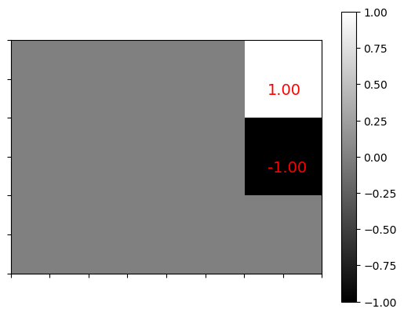
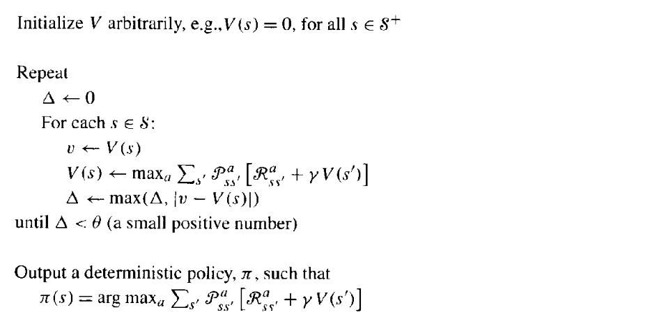
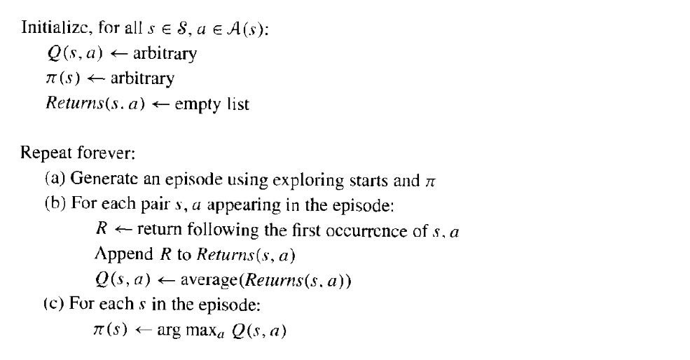
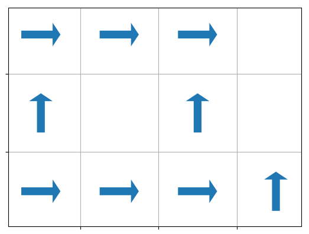
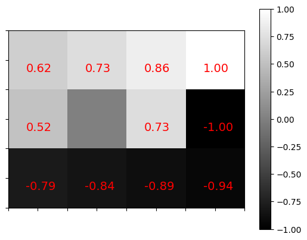
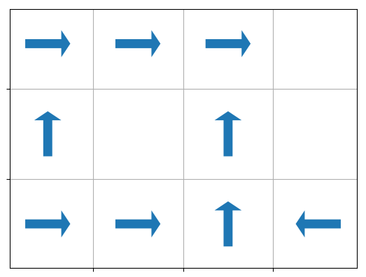
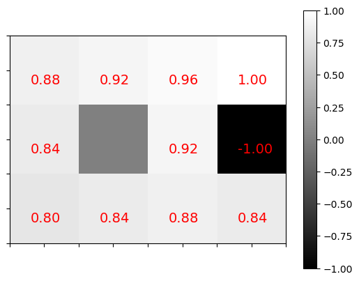

# Gridworld - Reinforcement learning


## Anaconda environment

```
conda env create --file requirement.yml
```

## Problem description

The gridworld problem is a good way to illustrate the fundamental aspects of reinforcement learning. The problem is to find a policy (i.e a mapping for each possible state give to an action) that maximize the payoff.  For the gridworld problem, we have two cost. The first one is associate with two specific terminal state and a cost by move in the grid. We thus have an agent moving in a grid trying to find the grid where the treasure is (payoff of 1 unit) without falling into a hole (payoff of -1) with a cost per step that be associate with fuel in the real world.



Since we have only the payoff for terminal states, the first step is to evaluate the payoff for other states. Those local payoff will depend of the policy chosen. We thus have a loop where we evaluate the payoff to find a good strategy and use that strategy to evaluate new payoffs which will give a new strategy etc.


## Algorithm

*Principal reference* Reinforcement Learning: An Introduction by Andrew Barton and Richard S. Sutton

The basic steps are:

1. Initialisation 
2. Value function evaluation
3. Policy Improvement

One can evaluate a policy by iteration with the pseudo code

-------------------




-----------------------

or by using the Monte Carlo method

---------------------------



-----------------------


## A short example

### Initial policy

The initial policy for the example is:




We will evaluate the value function by value iteration or Monte Carlo t o to obtain the expected payoff at each state:



### Improving the policy

We can improve the policy by a greedy approach from the expected payoff for each states to obtain:





and evaluate the new policy values (using Monte Carlo or Value Iteration)  to obtain





## Unittest

To run the tests:

```bash
python grid_test.py
```


